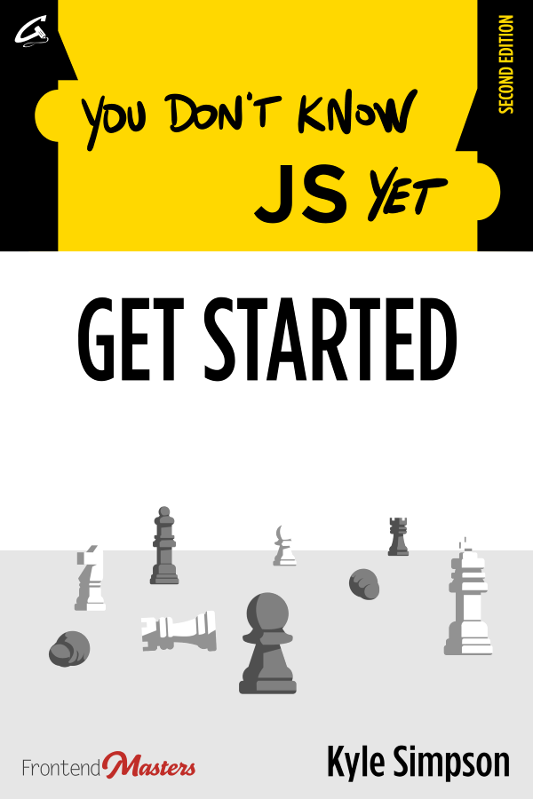
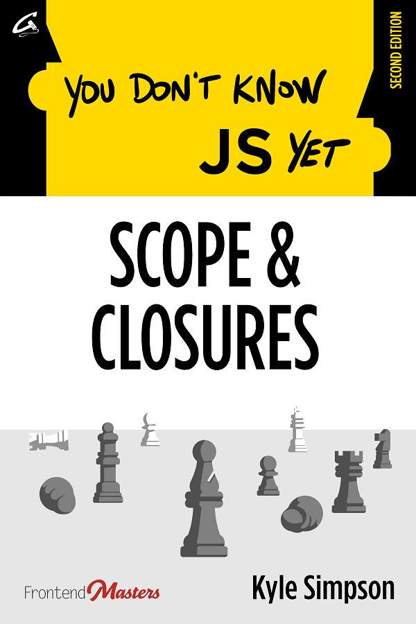

# You Don't Know JS Yet (Bộ sách) - Phiên bản thứ 2

Đây là một bộ sách đi sâu vào các cơ chế cốt lỗi của ngôn ngữ JavaScript. Đây là **ấn bản thứ hai** của bộ sách:

&nbsp;&nbsp;
&nbsp;&nbsp;...

**Để đọc thêm về động lực và quan điểm đằng sau bộ sách này, hãy xem [Lời nói đầu](preface.md).**

Nếu bạn đang tìm kiếm **ấn bản thứ nhất** sách , [chúng có thể được tìm thấy ở đây](https://github.com/getify/You-Dont-Know-JS/blob/1st-ed/README.md).

## Nhà tài trợ cao cấp

Ấn bản này của **YDKJS** bộ sách được tài trợ độc quyền bởi [Frontend Masters](https://frontendmasters.com).

Frontend Masters là tiêu chuẩn vàng cho tài liệu đào tạo chuyên gia hàng đầu về phát triển phần mềm theo định hướng frontend. Với hơn 150 khóa học về giao diện người dùng, đây sẽ là điểm dừng đầu tiên và duy nhất của bạn để đào tạo video chất lượng về HTML, CSS, JS và các công nghệ liên quan.

----

Tôi muốn gửi lời cảm ơn sâu sắc và nồng nhiệt tới Marc Grabanski và toàn bộ nhóm Frontend Masters, không chỉ vì công việc xuất sắc của họ với nền tảng đào tạo video, mà còn vì sự ủng hộ vững chắc của họ đối với tôi và của sách "You Don't Know JS"!

----

## Tiêu đề

Tôi khuyên bạn nên đọc các sách **ấn bản thứ hai** theo thứ tự này:

* [Get Started](get-started/README.md) | [Buy on Leanpub](https://leanpub.com/ydkjsy-get-started) | [Buy on Amazon](https://www.amazon.com/dp/B084BNMN7T)
* [Scope & Closures](scope-closures/README.md) | [Buy on Leanpub](https://leanpub.com/ydkjsy-scope-closures) | [Buy on Amazon](https://www.amazon.com/dp/B08634PZ3N)
* Objects & Classes (vẫn chưa bắt đầu)
* Types & Grammar (vẫn chưa bắt đầu)
* Sync & Async (vẫn chưa bắt đầu)
* ES.Next & Beyond (vẫn chưa bắt đầu)

## Xuất bản

Như mọi khi, bạn sẽ có thể đọc những cuốn sách này trực tuyến tại đây hoàn toàn miễn phí.

Ấn bản này của sách đang được tự xuất bản thông qua xuất bản [GetiPub](https://geti.pub). Sách đã xuất bản sẽ được bán thông qua các nguồn bán lẻ sách thông thường.

## Đóng góp

Vui lòng đóng góp vào chất lượng của nội dung này bằng cách gửi PR để cải thiện đoạn mã, giải thích, v.v. Mặc dù các bản sửa lỗi chính tả được hoan nghênh, nhưng chúng có thể sẽ bị bắt qua quy trình chỉnh sửa / xuất bản thông thường, **vì vậy, xin đừng lo lắng về họ ngay bây giờ.**

Mọi đóng góp của bạn cho nỗ lực này **tất nhiên được đánh giá rất cao**.

Nhưng **VUI LÒNG** đọc kỹ [Nguyên tắc đóng góp](CONTRIBUTING.md) trước khi gửi bài PR.

## Giấy phép & Bản quyền

Các tài liệu ở đây đều là © 2019-2020 Kyle Simpson.

