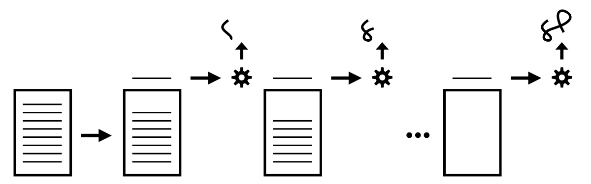

# Bạn chưa biết JS: Bắt đầu - Phiên bản thứ 2
# Chương 1: *JavaScript là gì?*

Bạn chưa biết JS. Tôi cũng vậy, không đầy đủ dù sao. Không ai trong chúng tôi làm. Nhưng tất cả chúng ta đều có thể bắt đầu hiểu rõ hơn về JS.

Trong chương đầu tiên này của cuốn sách đầu tiên của bộ sách *Bạn chưa biết JS* (YDKJSY), chúng ta sẽ dành một chút thời gian để xây dựng nền tảng để tiếp tục. Chúng ta cần bắt đầu bằng cách bao gồm một loạt các chi tiết quan trọng về quản lý nội bộ nền tảng, xóa bỏ một số lầm tưởng và quan niệm sai lầm về ngôn ngữ thực sự là gì (và không phải!).

Đây là cái nhìn sâu sắc có giá trị về danh tính và quy trình cách JS được tổ chức và duy trì; tất cả các nhà phát triển JS nên hiểu nó. Nếu bạn muốn làm quen với JS, đây là cách để *bắt đầu* thực hiện những bước đầu tiên trong hành trình đó.

## Về cuốn sách này

Tôi nhấn mạnh từ hành trình bởi vì *biết JS* không phải là đích đến, mà là hướng đi. Bất kể bạn dành bao nhiêu thời gian cho ngôn ngữ, bạn sẽ luôn có thể tìm thấy thứ khác để học và hiểu tốt hơn một chút. Vì vậy, đừng xem cuốn sách này như một thứ gì đó vội vàng để đạt được thành tích nhanh chóng. Thay vào đó, sự kiên nhẫn và kiên trì là tốt nhất khi bạn thực hiện một vài bước đầu tiên.

Tiếp theo chương cơ bản này, phần còn lại của cuốn sách sẽ đưa ra một bản đồ cấp cao về những gì bạn sẽ tìm thấy khi tìm hiểu và nghiên cứu về JS với các cuốn sách YDKJSY.

Đặc biệt, Chương 4 xác định ba trụ cột chính mà ngôn ngữ JS được tổ chức xung quanh: phạm vi / đóng, nguyên mẫu / đối tượng và kiểu / cưỡng chế. JS là một ngôn ngữ rộng và phức tạp, có nhiều tính năng và khả năng. Nhưng tất cả JS đều được thành lập dựa trên ba trụ cột cơ bản này.

Hãy nhớ rằng mặc dù cuốn sách này có tiêu đề "Bắt đầu", nhưng nó **không nhằm mục đích là một cuốn sách dành cho người mới bắt đầu / giới thiệu**. Công việc chính của cuốn sách này là giúp bạn sẵn sàng nghiên cứu sâu về JS trong suốt phần còn lại của bộ sách; nó được viết giả sử bạn đã quen với JS qua ít nhất vài tháng kinh nghiệm trước khi chuyển sang YDKJSY. Vì vậy, để tận dụng tối đa *Bắt đầu*, hãy đảm bảo bạn dành nhiều thời gian viết mã JS để xây dựng trải nghiệm của mình.

Ngay cả khi bạn đã viết rất nhiều JS trước đây, cuốn sách này không nên đọc lướt qua hoặc bỏ qua; dành thời gian của bạn để xử lý đầy đủ các tài liệu ở đây. **Một khởi đầu tốt luôn phụ thuộc vào bước đầu tiên vững chắc.**

## Có gì với tên đó?

Tên JavaScript có lẽ là tên ngôn ngữ lập trình bị nhầm lẫn và hiểu nhầm nhất.

Ngôn ngữ này có liên quan đến Java không? Nó chỉ có dạng tập lệnh cho Java? Nó chỉ dùng để viết kịch bản chứ không phải chương trình thực?

Sự thật là, cái tên JavaScript là một tạo tác của những trò lừa bịp tiếp thị. Khi Brendan Eich lần đầu tiên hình thành ngôn ngữ này, ông đã đặt tên mã cho nó là Mocha. Trong nội bộ Netscape, thương hiệu LiveScript đã được sử dụng. Nhưng đến lúc công khai tên ngôn ngữ, "JavaScript" đã giành được phiếu bầu.

Tại sao? Bởi vì ngôn ngữ này ban đầu được thiết kế để thu hút khán giả chủ yếu là các lập trình viên Java, và vì từ "script" phổ biến vào thời điểm đó để chỉ các chương trình nhẹ. Những "tập lệnh" nhẹ này sẽ là những tập lệnh đầu tiên được nhúng vào bên trong các trang trên một thứ mới được gọi là web!

Nói cách khác, JavaScript là một mưu đồ tiếp thị để cố gắng định vị ngôn ngữ này như một sự thay thế dễ chịu cho việc viết Java nặng hơn và nổi tiếng hơn trong ngày. Nó có thể dễ dàng được gọi là "WebJava", vì vấn đề đó.

Có một số điểm giống nhau bề ngoài giữa mã JavaScript và mã Java. Những điểm tương đồng đó đặc biệt không đến từ sự phát triển được chia sẻ, mà từ cả hai ngôn ngữ nhắm mục tiêu đến các nhà phát triển với các kỳ vọng cú pháp giả định từ C (và ở một mức độ nào đó, C ++).

Ví dụ: chúng tôi sử dụng dấu `{` để bắt đầu một khối mã và `}` để kết thúc khối mã đó, giống như C / C ++ và Java. Chúng tôi cũng sử dụng dấu `;` để chấm câu cuối câu.

Theo một số cách, các mối quan hệ pháp lý thậm chí còn sâu hơn cả cú pháp. Oracle (thông qua Sun), công ty vẫn sở hữu và điều hành Java, cũng sở hữu nhãn hiệu chính thức cho tên "JavaScript" (thông qua Netscape). Nhãn hiệu này hầu như không bao giờ được thực thi, và có thể không có vào thời điểm này.

Vì những lý do này, một số đã đề xuất chúng tôi sử dụng JS thay vì JavaScript. Đó là một cách viết tắt rất phổ biến, nếu không phải là một ứng cử viên sáng giá cho việc xây dựng thương hiệu ngôn ngữ chính thức. Thật vậy, những cuốn sách này hầu như chỉ sử dụng JS để tham khảo ngôn ngữ.

Khác xa hơn nữa ngôn ngữ với nhãn hiệu thuộc sở hữu của Oracle, tên chính thức của ngôn ngữ do TC39 chỉ định và được cơ quan tiêu chuẩn ECMA chính thức hóa là ** ECMAScript **. Và thực sự, kể từ năm 2016, tên ngôn ngữ chính thức cũng đã được thêm vào theo năm sửa đổi; kể từ văn bản này, đó là ECMAScript 2019, hay còn được viết tắt là ES2019.

Nói cách khác, JavaScript / JS chạy trong trình duyệt của bạn hoặc trong Node.js, là *một* triển khai của tiêu chuẩn ES2019.

| GHI CHÚ: |
| :--- |
| Không sử dụng các thuật ngữ như "JS6" hoặc "ES8" để chỉ ngôn ngữ. Một số thì có, nhưng những điều khoản đó chỉ nhằm mục đích duy trì sự nhầm lẫn. "ES20xx" hoặc chỉ "JS" là những gì bạn nên sử dụng.|

Cho dù bạn gọi nó là JavaScript, JS, ECMAScript hay ES2019, nó chắc chắn không phải là một biến thể của ngôn ngữ Java!

> "Java là JavaScript giống như hamster là hamster." --Jeremy Keith, 2009

## Đặc điểm ngôn ngữ

Tôi đã đề cập đến TC39, ban chỉ đạo kỹ thuật quản lý JS. Nhiệm vụ chính của họ là quản lý đặc tả chính thức cho ngôn ngữ. Họ họp thường xuyên để bỏ phiếu về bất kỳ thay đổi nào đã được đồng ý, sau đó họ sẽ đệ trình lên ECMA, tổ chức tiêu chuẩn.

Cú pháp và hành vi của JS được định nghĩa trong đặc tả ES.

ES2019 tình cờ là đặc điểm kỹ thuật / bản sửa đổi được đánh số chính thứ 10 kể từ khi JS ra đời vào năm 1995, vì vậy trong URL chính thức của thông số kỹ thuật do ECMA lưu trữ, bạn sẽ tìm thấy "10.0":

https://www.ecma-international.org/ecma-262/10.0/

Ủy ban TC39 bao gồm từ 50 đến khoảng 100 người khác nhau từ một bộ phận lớn các công ty đầu tư vào web, chẳng hạn như các nhà sản xuất trình duyệt (Mozilla, Google, Apple) và các nhà sản xuất thiết bị (Samsung, v.v.). Tất cả các thành viên của ủy ban đều là tình nguyện viên, mặc dù nhiều người trong số họ là nhân viên của các công ty này và do đó có thể nhận được một phần thù lao cho các nhiệm vụ của họ trong ủy ban.

TC39 thường họp khoảng hai tháng một lần, thường trong khoảng ba ngày, để xem xét công việc mà các thành viên đã thực hiện kể từ cuộc họp cuối cùng, thảo luận các vấn đề và bỏ phiếu về các đề xuất. Địa điểm họp luân phiên giữa các công ty thành viên sẵn sàng tổ chức.

Tất cả các đề xuất TC39 đều tiến triển thông qua quy trình năm giai đoạn — tất nhiên, vì chúng tôi là lập trình viên, nên nó dựa trên 0! —Phần 0 đến Giai đoạn 4. Bạn có thể đọc thêm về quy trình Giai đoạn tại đây: https://tc39.es/process-document/

Giai đoạn 0 có nghĩa là đại khái, một người nào đó trên TC39 cho rằng đó là một ý tưởng xứng đáng và lên kế hoạch vô địch và bắt tay vào thực hiện. Điều đó có nghĩa là rất nhiều ý tưởng mà những người không phải là thành viên TC39 "đề xuất", thông qua các phương tiện không chính thức như mạng xã hội hoặc các bài đăng trên blog, thực sự là "tiền giai đoạn 0". Bạn phải có được một thành viên TC39 vô địch một đề xuất để nó được coi là "Giai đoạn 0" chính thức.

Khi một đề xuất đạt đến trạng thái "Giai đoạn 4", đề xuất đó đủ điều kiện để được đưa vào bản sửa đổi hàng năm của ngôn ngữ. Có thể mất từ vài tháng đến vài năm để một đề xuất hoàn thành các giai đoạn này.

Tất cả các đề xuất được quản lý mở, trên kho lưu trữ Github của TC39: https://github.com/tc39/proposals

Bất kỳ ai, dù thuộc TC39 hay không, đều được hoan nghênh tham gia vào các cuộc thảo luận công khai này và các quy trình làm việc trên các đề xuất. Tuy nhiên, chỉ các thành viên TC39 mới có thể tham dự các cuộc họp và biểu quyết về các đề xuất và thay đổi. Vì vậy, trên thực tế, giọng nói của một thành viên TC39 có rất nhiều trọng lượng trong việc JS sẽ đi đến đâu.

Trái ngược với một số huyền thoại lâu đời và gây khó chịu, có * không * nhiều phiên bản JavaScript trong tự nhiên. Chỉ có ** một JS **, tiêu chuẩn chính thức được duy trì bởi TC39 và ECMA.

Trở lại đầu những năm 2000, khi Microsoft duy trì một phiên bản JS được phân nhánh và thiết kế ngược (và không hoàn toàn tương thích) được gọi là "JScript", thì hợp pháp đã có "nhiều phiên bản" của JS. Nhưng những ngày đó đã qua lâu rồi. Thật lỗi thời và không chính xác khi đưa ra những tuyên bố như vậy về JS ngày nay.

Tất cả các trình duyệt và nhà sản xuất thiết bị lớn đã cam kết giữ cho việc triển khai JS của họ tuân thủ với một đặc tả trung tâm này. Tất nhiên, các động cơ thực hiện các tính năng vào những thời điểm khác nhau. Nhưng sẽ không bao giờ xảy ra trường hợp công cụ v8 (công cụ JS của Chrome) triển khai một tính năng được chỉ định khác hoặc không tương thích so với công cụ SpiderMonkey (công cụ JS của Mozilla).

Điều đó có nghĩa là bạn có thể học ** một JS ** và dựa trên cùng một JS đó ở mọi nơi.

### Web quy định mọi thứ về (JS)

Trong khi mảng môi trường chạy JS không ngừng mở rộng (từ trình duyệt, đến máy chủ (Node.js), tới rô bốt, đến bóng đèn, tới ...), thì một môi trường quy định JS là web. Nói cách khác, cách JS được triển khai cho các trình duyệt web, trên thực tế, là thực tế duy nhất quan trọng.

Đối với hầu hết các phần, JS được định nghĩa trong đặc tả và JS chạy trong các công cụ JS dựa trên trình duyệt là giống nhau. Nhưng có một số khác biệt phải được xem xét

Đôi khi đặc tả JS sẽ quy định một số hành vi mới hoặc tinh chỉnh, nhưng điều đó sẽ không khớp chính xác với cách nó hoạt động trong các công cụ JS dựa trên trình duyệt. Sự không phù hợp như vậy là lịch sử: các công cụ JS đã có hơn 20 năm hoạt động có thể quan sát được xung quanh các trường hợp góc của các tính năng đã được nội dung web dựa vào. Như vậy, đôi khi các công cụ JS sẽ từ chối tuân theo một thay đổi do đặc tả chỉ định bởi vì nó sẽ phá vỡ nội dung web đó.

Trong những trường hợp này, thường TC39 sẽ quay lại và chỉ cần chọn để phù hợp với đặc điểm kỹ thuật cho thực tế của web. Ví dụ: TC39 đã lên kế hoạch thêm một `contains(..)` phương thức cho Mảng, nhưng người ta thấy rằng tên này xung đột với các khuôn khổ JS cũ vẫn được sử dụng trên một số trang web, vì vậy họ đã đổi tên thành không xung đột `includes(..)`. Điều tương tự cũng xảy ra với một JS hài hước / bi kịch *community crisis* được đặt tên là "Smooshgate", nơi đã lên kế hoạch `flatten(..)` phương thức cuối cùng đã được đổi tên `flat(..)`.

Nhưng đôi khi, TC39 sẽ quyết định đặc điểm kỹ thuật sẽ bám chắc vào một thời điểm nào đó mặc dù không chắc rằng các công cụ JS dựa trên trình duyệt sẽ không bao giờ tuân theo.

Giải pháp? Phụ lục B, "Các tính năng ECMAScript bổ sung cho trình duyệt web". [^ SpecApB] Đặc tả JS bao gồm phụ lục này để nêu chi tiết về bất kỳ sự không khớp nào đã biết giữa đặc tả JS chính thức và thực tế của JS trên web. Nói cách khác, đây là những ngoại lệ được phép *chỉ* đối với web JS; các môi trường JS khác phải tuân theo quy định của pháp luật.

Phần B.1 và B.2 bao gồm * bổ sung * cho JS (cú pháp và API) mà web JS bao gồm, một lần nữa vì lý do lịch sử, nhưng TC39 không có kế hoạch chỉ định chính thức trong lõi của JS. Các ví dụ bao gồm các ký tự bát phân có tiền tố `0`, toàn cầu `escape(..)` / `unescape(..)` tiện ích, chuỗi "trợ giúp" như `anchor(..)` và `blink()`, và RegExp `compile(..)` phương thức.

Phần B.3 bao gồm một số xung đột trong đó mã có thể chạy trong cả công cụ JS web và không phải web, nhưng trong đó hành vi *có thể* khác nhau một cách có thể quan sát được, dẫn đến các kết quả khác nhau. Hầu hết các thay đổi được liệt kê liên quan đến các tình huống được gắn nhãn là lỗi sớm khi mã đang chạy ở chế độ nghiêm ngặt.

Phụ lục B *gotchas* không thường xuyên gặp phải, nhưng bạn vẫn nên tránh những cấu trúc này để được an toàn trong tương lai. Bất cứ khi nào có thể, hãy tuân thủ đặc tả JS và không dựa vào hành vi chỉ áp dụng trong một số môi trường công cụ JS nhất định.

### Không phải Tất cả (Web) JS...

Is this code a JS program?

```js
alert("Hello, JS!");
```

Phụ thuộc vào cách bạn nhìn nhận mọi thứ. Các `alert(..)` hàm hiển thị ở đây không được bao gồm trong đặc tả JS, nhưng nó *là* trong tất cả các môi trường JS web. Tuy nhiên, bạn sẽ không tìm thấy nó trong Phụ lục B, vậy điều gì mang lại?

Các môi trường JS khác nhau (như công cụ JS của trình duyệt, Node.js, v.v.) thêm các API vào phạm vi toàn cầu của các chương trình JS của bạn để cung cấp cho bạn các khả năng dành riêng cho môi trường, chẳng hạn như có thể bật một hộp kiểu cảnh báo trong trình duyệt của người dùng.

Trên thực tế, một loạt các API trông như JS, như `fetch(..)`, `getCurrentLocation(..)`, và `getUserMedia(..)`, là tất cả các API web trông giống như JS. Trong Node.js, chúng ta có thể truy cập hàng trăm phương thức API từ các mô-đun tích hợp sẵn khác nhau, như `fs.write(..)`.

Một ví dụ phổ biến khác là `console.log(..)` (và tất cả những thứ khác `console.*` phương thức!). Chúng không được chỉ định trong JS, nhưng vì tiện ích phổ biến của chúng được định nghĩa bởi khá nhiều môi trường JS, theo một consensu đã được thống nhất.

Vì thế `alert(..)`và `console.log(..)` không được định nghĩa bởi JS. Nhưng chúng * trông * giống JS. Chúng là các hàm và các phương thức đối tượng và chúng tuân theo các quy tắc cú pháp JS. Các hành vi đằng sau chúng được kiểm soát bởi môi trường chạy JS engine, nhưng bề ngoài thì chúng chắc chắn phải tuân theo JS để có thể chơi trong sân chơi JS.

Hầu hết sự khác biệt giữa các trình duyệt mà mọi người phàn nàn về "JS quá không nhất quán!" tuyên bố thực sự là do sự khác biệt về cách hoạt động của các hành vi môi trường đó, không phải do chính JS hoạt động.

vì vậy, một `alert(..)` Gọi *là* JS, nhưng `alert` bản thân nó thực sự chỉ là một khách mời, không phải là một phần của đặc tả JS chính thức.

### Không phải lúc nào cũng JS

Sử dụng bảng điều khiển / REPL (Đọc-Đánh giá-In-Vòng lặp) trong Công cụ dành cho nhà phát triển (hoặc Node) của trình duyệt của bạn, thoạt nhìn giống như một môi trường JS khá đơn giản. Nhưng nó không thực sự.

Developer Tools là ... công cụ dành cho các nhà phát triển. Mục đích chính của họ là làm cho cuộc sống của các nhà phát triển dễ dàng hơn. Họ ưu tiên DX (Kinh nghiệm của nhà phát triển). Mục tiêu *không phải* của các công cụ như vậy là phản ánh chính xác và thuần túy tất cả các sắc thái của hành vi JS nghiêm ngặt. Do đó, có nhiều câu hỏi kỳ quặc có thể hoạt động như "gotchas" nếu bạn đang coi bảng điều khiển như một môi trường JS *thuần túy*.

Tiện thể này là một điều tốt, nhân tiện! Tôi rất vui vì Công cụ dành cho nhà phát triển giúp cuộc sống của các nhà phát triển dễ dàng hơn! Tôi rất vui vì chúng tôi có các tính năng UX đẹp mắt như tự động hoàn thành các biến / thuộc tính, v.v. Tôi chỉ chỉ ra rằng chúng ta không thể và không nên mong đợi các công cụ như vậy *luôn* tuân thủ nghiêm ngặt cách các chương trình JS được xử lý vì đó không phải là mục đích của những công cụ này.

Vì các công cụ như vậy khác nhau về hành vi giữa các trình duyệt và vì chúng thay đổi (đôi khi khá thường xuyên), tôi sẽ không "mã hóa cứng" bất kỳ chi tiết cụ thể nào vào văn bản này, do đó đảm bảo văn bản sách này nhanh chóng lỗi thời.

Nhưng tôi sẽ chỉ gợi ý về một số ví dụ về các câu hỏi kỳ quặc đã đúng ở nhiều điểm khác nhau trong các môi trường bảng điều khiển JS khác nhau, để củng cố quan điểm của tôi về việc không giả định hành vi JS gốc khi sử dụng chúng:

* Liệu một `var`  hoặc `function` khai báo trong "phạm vi toàn cầu" cấp cao nhất của bảng điều khiển thực sự tạo ra một biến toàn cục thực (và được sao chép `window` property, và ngược lại!).

* Điều gì xảy ra với nhiều `let` và `const` khai báo trong "phạm vi toàn cầu" cấp cao nhất.

* Liệu `"use strict";` trên một mục nhập dòng (nhấn `<enter>` sau) bật chế độ nghiêm ngặt cho phần còn lại của phiên bảng điều khiển đó, theo cách nó sẽ hoạt động trên dòng đầu tiên của tệp .js, cũng như liệu bạn có thể sử dụng `"use strict";` vượt quá "dòng đầu tiên" và vẫn bật chế độ nghiêm ngặt cho phiên đó.

* Cách chế độ không nghiêm ngặt `this` ràng buộc mặc định hoạt động đối với các lệnh gọi hàm và liệu "đối tượng toàn cục" được sử dụng có chứa các biến toàn cục dự kiến ​​hay không.

* Cách vận thăng (xem Quyển 2, * Phạm vi & Đóng cửa *) hoạt động trên nhiều mục nhập dòng.

* ...several others

Bảng điều khiển dành cho nhà phát triển không cố gắng giả vờ là một trình biên dịch JS xử lý mã đã nhập của bạn chính xác giống như cách công cụ JS xử lý tệp .js. Nó đang cố gắng giúp bạn dễ dàng nhập nhanh một vài dòng mã và xem kết quả ngay lập tức. Đây là những trường hợp sử dụng hoàn toàn khác nhau và do đó, thật không hợp lý khi mong đợi một công cụ xử lý cả hai như nhau.

Đừng tin tưởng hành vi nào bạn thấy trong bảng điều khiển dành cho nhà phát triển là đại diện cho ngữ nghĩa JS *chính xác* thành từng chữ cái; đối với điều đó, hãy đọc thông số kỹ thuật. Thay vào đó, hãy nghĩ về bảng điều khiển như một môi trường "thân thiện với JS". Điều đó hữu ích theo đúng nghĩa của nó.

## Nhiều mặt

Thuật ngữ "mô hình" trong ngữ cảnh ngôn ngữ lập trình đề cập đến cách tiếp cận và tư duy rộng rãi (gần như phổ biến) để cấu trúc mã. Trong một mô hình, có vô số biến thể về kiểu và hình thức phân biệt các chương trình, bao gồm vô số thư viện và khuôn khổ khác nhau để lại chữ ký duy nhất của chúng trên bất kỳ mã nhất định nào.

Nhưng cho dù phong cách riêng của một chương trình có thể như thế nào, thì những phân chia hình ảnh lớn xung quanh các mô hình hầu như luôn hiển nhiên trong cái nhìn đầu tiên của bất kỳ chương trình nào.

Các danh mục mã cấp mô hình điển hình bao gồm thủ tục, hướng đối tượng (OO / lớp) và chức năng (FP):

* Phong cách thủ tục tổ chức mã theo tiến trình tuyến tính từ trên xuống thông qua một tập hợp các thao tác được xác định trước, thường được tập hợp lại với nhau trong các đơn vị liên quan được gọi là thủ tục.

* Kiểu OO tổ chức mã bằng cách thu thập logic và dữ liệu lại với nhau thành các đơn vị được gọi là các lớp.

* Kiểu FP tổ chức mã thành các hàm (các phép tính thuần túy thay vì các thủ tục), và sự thích nghi của các hàm đó dưới dạng các giá trị.

Mô hình không đúng cũng không sai. Chúng là những định hướng hướng dẫn và tạo khuôn mẫu cho cách các lập trình viên tiếp cận các vấn đề và giải pháp, cách họ cấu trúc và duy trì mã của mình.

Một số ngôn ngữ nghiêng nhiều về một mô hình — C là thủ tục, Java / C ++ gần như hoàn toàn là định hướng lớp và Haskell là FP xuyên suốt.

Nhưng nhiều ngôn ngữ cũng hỗ trợ các mẫu mã có thể đến từ, và thậm chí trộn và kết hợp từ các mô hình khác nhau. Vì vậy, được gọi là "ngôn ngữ đa mô hình" cung cấp tính linh hoạt tối đa. Trong một số trường hợp, một chương trình đơn lẻ thậm chí có thể có hai hoặc nhiều biểu thức của các mô hình này nằm cạnh nhau.

JavaScript chắc chắn là một ngôn ngữ đa mô hình. Bạn có thể viết mã kiểu thủ tục, hướng lớp hoặc kiểu FP và bạn có thể đưa ra các quyết định đó trên cơ sở từng dòng thay vì bị buộc phải lựa chọn tất cả hoặc không có gì.

## Lùi lại & Chuyển tiếp

Một trong những nguyên tắc cơ bản nhất hướng dẫn JavaScript là duy trì *khả năng tương thích ngược*. Nhiều người bị nhầm lẫn bởi hàm ý của thuật ngữ này và thường nhầm lẫn nó với một thuật ngữ có liên quan nhưng khác: *khả năng tương thích chuyển tiếp*.

Hãy lập kỷ lục thẳng thắn.

Khả năng tương thích ngược có nghĩa là một khi thứ gì đó được chấp nhận là JS hợp lệ, sẽ không có sự thay đổi trong tương lai đối với ngôn ngữ khiến mã đó trở thành JS không hợp lệ. Mã được viết vào năm 1995 - tuy nguyên thủy hoặc có giới hạn nhưng nó vẫn có thể hoạt động cho đến ngày nay. Như các thành viên TC39 thường tuyên bố, "chúng tôi không phá vỡ web!"

Ý tưởng là các nhà phát triển JS có thể viết mã với sự tự tin rằng mã của họ sẽ không ngừng hoạt động một cách khó lường vì bản cập nhật trình duyệt được phát hành. Điều này khiến quyết định chọn JS cho một chương trình trở thành một khoản đầu tư khôn ngoan và an toàn hơn, trong nhiều năm tới.

Sự “đảm bảo” đó không phải là chuyện nhỏ. Việc duy trì khả năng tương thích ngược, trải dài trong gần 25 năm lịch sử của ngôn ngữ, tạo ra một gánh nặng to lớn và vô số thách thức độc đáo. Bạn sẽ khó tìm thấy nhiều ví dụ khác trong việc tính toán cam kết tương thích ngược như vậy.

Không nên tùy tiện loại bỏ các chi phí của việc tuân thủ nguyên tắc này. Nó nhất thiết phải tạo ra một thanh cao để bao gồm việc thay đổi hoặc mở rộng ngôn ngữ; bất kỳ quyết định nào trở nên hiệu quả vĩnh viễn, sai lầm và tất cả. Một khi nó ở trong JS, nó không thể được lấy ra vì nó có thể phá vỡ các chương trình, ngay cả khi chúng tôi thực sự rất muốn xóa nó!

Có một số ngoại lệ nhỏ đối với quy tắc này. JS đã có một số thay đổi không tương thích ngược, nhưng TC39 cực kỳ thận trọng khi làm như vậy. Họ nghiên cứu mã hiện có trên web (thông qua thu thập dữ liệu trình duyệt) để ước tính tác động của sự cố như vậy và cuối cùng, các trình duyệt sẽ quyết định và bỏ phiếu xem họ có sẵn sàng đón nhận nhiệt độ từ người dùng đối với một sự cố rất nhỏ so với lợi ích hay không sửa hoặc cải thiện một số khía cạnh của ngôn ngữ cho nhiều trang web khác (và người dùng).

Những loại thay đổi này hiếm khi xảy ra và hầu như luôn xảy ra trong các trường hợp sử dụng góc mà khó có thể quan sát được ở nhiều trang web.

So sánh *tương thích ngược *với đối tác của nó, *tương thích chuyển tiếp *. Tương thích chuyển tiếp có nghĩa là bao gồm một bổ sung mới cho ngôn ngữ trong một chương trình sẽ không làm cho chương trình đó bị hỏng nếu nó được chạy trong một công cụ JS cũ hơn. **JS không tương thích chuyển tiếp**, mặc dù nhiều người mong muốn như vậy, và thậm chí tin tưởng sai lầm rằng nó là như vậy.

Ngược lại, HTML và CSS tương thích với nhau nhưng không tương thích ngược. Nếu bạn tìm hiểu một số HTML hoặc CSS được viết từ năm 1995, thì hoàn toàn có thể nó sẽ không hoạt động (hoặc hoạt động như cũ) ngày nay. Tuy nhiên, nếu bạn sử dụng một tính năng mới của năm 2019 trong trình duyệt từ năm 2010, trang sẽ không bị "hỏng" - CSS / HTML không được công nhận sẽ bị bỏ qua, trong khi phần còn lại của CSS / HTML sẽ được xử lý tương ứng.

Có vẻ như mong muốn khả năng tương thích chuyển tiếp được đưa vào thiết kế ngôn ngữ lập trình, nhưng nói chung là không thực tế khi làm như vậy. Đánh dấu (HTML) hoặc tạo kiểu (CSS) có bản chất là khai báo, vì vậy việc "bỏ qua" các khai báo không được công nhận dễ dàng hơn nhiều với tác động tối thiểu đến các khai báo được công nhận khác.

Nhưng sự hỗn loạn và không xác định sẽ xảy ra nếu một công cụ ngôn ngữ lập trình bỏ qua một cách chọn lọc các câu lệnh (hoặc thậm chí cả các biểu thức!) Mà nó không hiểu, vì không thể đảm bảo rằng phần tiếp theo của chương trình không mong đợi phần bị bỏ qua đã được xử lý.

Mặc dù JS không và không thể tương thích ngược, nhưng điều quan trọng là phải nhận ra khả năng tương thích ngược của JS, bao gồm những lợi ích lâu dài đối với web và kết quả là những ràng buộc và khó khăn mà nó đặt ra đối với JS.

### Jumping the Gaps

Vì JS không tương thích với chuyển tiếp, điều đó có nghĩa là luôn có khả năng tồn tại khoảng cách giữa mã mà bạn có thể viết JS hợp lệ và công cụ cũ nhất mà trang web hoặc ứng dụng của bạn cần hỗ trợ. Nếu bạn chạy một chương trình sử dụng tính năng ES2019 trong một công cụ từ năm 2016, bạn rất có thể thấy chương trình bị hỏng và gặp sự cố.

Nếu tính năng là một cú pháp mới, chương trình nói chung sẽ hoàn toàn không thể biên dịch và chạy, thường là lỗi cú pháp. Nếu tính năng là một API (chẳng hạn như ES6's `Object.is(..)`), chương trình có thể chạy đến một thời điểm nhưng sau đó đưa ra một ngoại lệ thời gian chạy và dừng lại khi nó gặp phải tham chiếu đến API không xác định.

Điều này có nghĩa là các nhà phát triển JS phải luôn tụt hậu so với tốc độ tiến độ, chỉ sử dụng mã nằm ở cạnh sau của môi trường engine JS cũ nhất mà họ cần hỗ trợ? Không!

Nhưng điều đó có nghĩa là các nhà phát triển JS cần phải quan tâm đặc biệt để giải quyết lỗ hổng này.

Đối với cú pháp mới và không tương thích, giải pháp là chuyển ngữ. Transpiling là một thuật ngữ do cộng đồng phát minh và sáng tạo để mô tả việc sử dụng một công cụ để chuyển đổi mã nguồn của một chương trình từ dạng này sang dạng khác (nhưng vẫn là mã nguồn dạng văn bản). Thông thường, các vấn đề tương thích chuyển tiếp liên quan đến cú pháp được giải quyết bằng cách sử dụng một bộ chuyển tiếp (phổ biến nhất là Babel (https://babeljs.io)) để chuyển đổi từ phiên bản cú pháp JS mới hơn sang một cú pháp cũ hơn tương đương.

Ví dụ: một nhà phát triển có thể viết một đoạn mã như:

```js
if (something) {
    let x = 3;
    console.log(x);
}
else {
    let x = 4;
    console.log(x);
}
```

Đây là cách mã sẽ trông như thế nào trong cây mã nguồn cho ứng dụng đó. Nhưng khi tạo (các) tệp để triển khai lên trang web công cộng, trình chuyển đổi Babel có thể chuyển đổi mã đó thành giống như sau:

```js
var x$0, x$1;
if (something) {
    x$0 = 3;
    console.log(x$0);
}
else {
    x$1 = 4;
    console.log(x$1);
}
```

Đoạn mã gốc dựa vào `let` để tạo các biến` x` phạm vi khối trong cả mệnh đề `if` và` else` không can thiệp vào nhau. Một chương trình tương đương (với mức làm việc lại tối thiểu) mà Babel có thể tạo ra chỉ cần chọn đặt tên cho hai biến khác nhau với những tên duy nhất, tạo ra cùng một kết quả không can thiệp.

| GHI CHÚ: |
| :--- |
| Từ khóa `let` đã được thêm vào ES6 (năm 2015). Ví dụ trước về chuyển ngữ sẽ chỉ cần áp dụng nếu một ứng dụng cần chạy trong môi trường JS hỗ trợ trước ES6. Ví dụ ở đây chỉ mang tính chất minh họa đơn giản. Khi ES6 mới ra đời, nhu cầu chuyển đổi như vậy khá phổ biến, nhưng vào năm 2020, nhu cầu hỗ trợ môi trường trước ES6 ít phổ biến hơn nhiều. Do đó, "mục tiêu" được sử dụng để chuyển đổi là một cửa sổ trượt chỉ chuyển lên trên khi đưa ra quyết định về việc trang web / ứng dụng ngừng hỗ trợ một số trình duyệt / công cụ cũ. |

Bạn có thể tự hỏi: tại sao lại gặp rắc rối khi sử dụng một công cụ để chuyển đổi từ phiên bản cú pháp mới hơn sang phiên bản cũ hơn? Chúng ta không thể chỉ viết hai biến và bỏ qua bằng cách sử dụng từ khóa `let`? Lý do là, các nhà phát triển nên sử dụng phiên bản JS mới nhất để mã của họ sạch sẽ và truyền đạt ý tưởng của nó một cách hiệu quả nhất.

Các nhà phát triển nên tập trung vào việc viết các biểu mẫu cú pháp mới, sạch sẽ và để các công cụ đảm nhận việc tạo ra phiên bản tương thích chuyển tiếp của mã đó phù hợp để triển khai và chạy trên môi trường công cụ JS cũ nhất được hỗ trợ.

### Filling the Gaps

Nếu vấn đề tương thích chuyển tiếp không liên quan đến cú pháp mới mà là do một phương thức API bị thiếu chỉ mới được thêm gần đây, giải pháp phổ biến nhất là cung cấp định nghĩa cho phương thức API bị thiếu đó tồn tại và hoạt động như thể môi trường cũ hơn đã có nó được định nghĩa nguyên bản. Mô hình này được gọi là polyfill (còn gọi là "miếng đệm").

Hãy xem xét mã này:

```js
// getSomeRecords() returns us a promise for some
// data it will fetch
var pr = getSomeRecords();

// show the UI spinner while we get the data
startSpinner();

pr
.then(renderRecords)   // render if successful
.catch(showError)      // show an error if not
.finally(hideSpinner)  // always hide the spinner
```

Mã này sử dụng một tính năng ES2019, phương thức `cuối cùng (..)` trên nguyên mẫu lời hứa. Nếu mã này được sử dụng trong môi trường trước ES2019, phương thức `cuối cùng (..)` sẽ không tồn tại và sẽ xảy ra lỗi.

Một polyfill cho `cuối cùng (..)` trong môi trường trước ES2019 có thể trông như thế này:

```js
if (!Promise.prototype.finally) {
    Promise.prototype.finally = function f(fn){
        return this.then(
            function t(v){
                return Promise.resolve( fn() )
                    .then(function t(){
                        return v;
                    });
            },
            function c(e){
                return Promise.resolve( fn() )
                    .then(function t(){
                        throw e;
                    });
            }
        );
    };
}
```

| WARNING: |
| :--- |
| This is only a simple illustration of a basic (not entirely spec-compliant) polyfill for `finally(..)`. Don't use this polyfill in your code; always use a robust, official polyfill wherever possible, such as the collection of polyfills/shims in ES-Shim. |

The `if` statement protects the polyfill definition by preventing it from running in any environment where the JS engine has already defined that method. In older environments, the polyfill is defined, but in newer environments the `if` statement is quietly skipped.

Transpilers like Babel typically detect which polyfills your code needs and provide them automatically for you. But occasionally you may need to include/define them explicitly, which works similar to the snippet we just looked at.

Always write code using the most appropriate features to communicate its ideas and intent effectively. In general, this means using the most recent stable JS version. Avoid negatively impacting the code's readability by trying to manually adjust for the syntax/API gaps. That's what tools are for!

Transpilation and polyfilling are two highly effective techniques for addressing that gap between code that uses the latest stable features in the language and the old environments a site or application needs to still support. Since JS isn't going to stop improving, the gap will never go away. Both techniques should be embraced as a standard part of every JS project's production chain going forward.

## What's in an Interpretation?

A long-debated question for code written in JS: is it an interpreted script or a compiled program? The majority opinion seems to be that JS is an interpreted (scripting) language. But the truth is more complicated than that.

For much of the history of programming languages, "interpreted" languages and "scripting" languages have been looked down on as inferior compared to their compiled counterparts. The reasons for this acrimony are numerous, including the perception that there is a lack of performance optimization, as well as dislike of certain language characteristics, such as scripting languages generally using dynamic typing instead of the "more mature" statically typed languages.

Languages regarded as "compiled" usually produce a portable (binary) representation of the program that is distributed for execution later. Since we don't really observe that kind of model with JS (we distribute the source code, not the binary form), many claim that disqualifies JS from the category. In reality, the distribution model for a program's "executable" form has become drastically more varied and also less relevant over the last few decades; to the question at hand, it doesn't really matter so much anymore what form of a program gets passed around.

These misinformed claims and criticisms should be set aside. The real reason it matters to have a clear picture on whether JS is interpreted or compiled relates to the nature of how errors are handled.

Historically, scripted or interpreted languages were executed in generally a top-down and line-by-line fashion; there's typically not an initial pass through the program to process it before execution begins (see Figure 1).

<figure>
    
    <figcaption><em>Fig. 1: Interpreted/Scripted Execution</em></figcaption>
    <br><br>
</figure>

In scripted or interpreted languages, an error on line 5 of a program won't be discovered until lines 1 through 4 have already executed. Notably, the error on line 5 might be due to a runtime condition, such as some variable or value having an unsuitable value for an operation, or it may be due to a malformed statement/command on that line. Depending on context, deferring error handling to the line the error occurs on may be a desirable or undesirable effect.

Compare that to languages which do go through a processing step (typically, called parsing) before any execution occurs, as illustrated in Figure 2:

<figure>
    
    <figcaption><em>Fig. 2: Parsing + Compilation + Execution</em></figcaption>
    <br><br>
</figure>

In this processing model, an invalid command (such as broken syntax) on line 5 would be caught during the parsing phase, before any execution has begun, and none of the program would run. For catching syntax (or otherwise "static") errors, generally it's preferred to know about them ahead of any doomed partial execution.

So what do "parsed" languages have in common with "compiled" languages? First, all compiled languages are parsed. So a parsed language is quite a ways down the road toward being compiled already. In classic compilation theory, the last remaining step after parsing is code generation: producing an executable form.

Once any source program has been fully parsed, it's very common that its subsequent execution will, in some form or fashion, include a translation from the parsed form of the program—usually called an Abstract Syntax Tree (AST)—to that executable form.

In other words, parsed languages usually also perform code generation before execution, so it's not that much of a stretch to say that, in spirit, they're compiled languages.

JS source code is parsed before it is executed. The specification requires as much, because it calls for "early errors"—statically determined errors in code, such as a duplicate parameter name—to be reported before the code starts executing. Those errors cannot be recognized without the code having been parsed.

So **JS is a parsed language**, but is it *compiled*?

The answer is closer to yes than no. The parsed JS is converted to an optimized (binary) form, and that "code" is subsequently executed (Figure 2); the engine does not commonly switch back into line-by-line execution (like Figure 1) mode after it has finished all the hard work of parsing—most languages/engines wouldn't, because that would be highly inefficient.

To be specific, this "compilation" produces a binary byte code (of sorts), which is then handed to the "JS virtual machine" to execute. Some like to say this VM is "interpreting" the byte code. But then that means Java, and a dozen other JVM-driven languages, for that matter, are interpreted rather than compiled. Of course, that contradicts the typical assertion that Java/etc are compiled languages.

Interestingly, while Java and JavaScript are very different languages, the question of interpreted/compiled is pretty closely related between them!

Another wrinkle is that JS engines can employ multiple passes of JIT (Just-In-Time) processing/optimization on the generated code (post parsing), which again could reasonably be labeled either "compilation" or "interpretation" depending on perspective. It's actually a fantastically complex situation under the hood of a JS engine.

So what do these nitty-gritty details boil down to? Step back and consider the entire flow of a JS source program:

1. After a program leaves a developer's editor, it gets transpiled by Babel, then packed by Webpack (and perhaps half a dozen other build processes), then it gets delivered in that very different form to a JS engine.

2. The JS engine parses the code to an AST.

3. Then the engine converts that AST to a kind-of byte code, a binary intermediate representation (IR), which is then refined/converted even further by the optimizing JIT compiler.

4. Finally, the JS VM executes the program.

To visualize those steps, again:

<figure>
    
    <figcaption><em>Fig. 3: Parsing, Compiling, and Executing JS</em></figcaption>
    <br><br>
</figure>

Is JS handled more like an interpreted, line-by-line script, as in Figure 1, or is it handled more like a compiled language that's processed in one-to-several passes first, before execution (as in Figures 2 and 3)?

I think it's clear that in spirit, if not in practice, **JS is a compiled language**.

And again, the reason that matters is, since JS is compiled, we are informed of static errors (such as malformed syntax) before our code is executed. That is a substantively different interaction model than we get with traditional "scripting" programs, and arguably more helpful!

### Web Assembly (WASM)

One dominating concern that has driven a significant amount of JS's evolution is performance, both how quickly JS can be parsed/compiled and how quickly that compiled code can be executed.

In 2013, engineers from Mozilla Firefox demonstrated a port of the Unreal 3 game engine from C to JS. The ability for this code to run in a browser JS engine at full 60fps performance was predicated on a set of optimizations that the JS engine could perform specifically because the JS version of the Unreal engine's code used a style of code that favored a subset of the JS language, named "ASM.js".

This subset is valid JS written in ways that are somewhat uncommon in normal coding, but which signal certain important typing information to the engine that allow it to make key optimizations. ASM.js was introduced as one way of addressing the pressures on the runtime performance of JS.

But it's important to note that ASM.js was never intended to be code that was authored by developers, but rather a representation of a program having been transpiled from another language (such as C), where these typing "annotations" were inserted automatically by the tooling.

Several years after ASM.js demonstrated the validity of tooling-created versions of programs that can be processed more efficiently by the JS engine, another group of engineers (also, initially, from Mozilla) released Web Assembly (WASM).

WASM is similar to ASM.js in that its original intent was to provide a path for non-JS programs (C, etc.) to be converted to a form that could run in the JS engine. Unlike ASM.js, WASM chose to additionally get around some of the inherent delays in JS parsing/compilation before a program can execute, by representing the program in a form that is entirely unlike JS.

WASM is a representation format more akin to Assembly (hence, its name) that can be processed by a JS engine by skipping the parsing/compilation that the JS engine normally does. The parsing/compilation of a WASM-targeted program happen ahead of time (AOT); what's distributed is a binary-packed program ready for the JS engine to execute with very minimal processing.

An initial motivation for WASM was clearly the potential performance improvements. While that continues to be a focus, WASM is additionally motivated by the desire to bring more parity for non-JS languages to the web platform. For example, if a language like Go supports threaded programming, but JS (the language) does not, WASM offers the potential for such a Go program to be converted to a form the JS engine can understand, without needing a threads feature in the JS language itself.

In other words, WASM relieves the pressure to add features to JS that are mostly/exclusively intended to be used by transpiled programs from other languages. That means JS feature development can be judged (by TC39) without being skewed by interests/demands in other language ecosystems, while still letting those languages have a viable path onto the web.

Another perspective on WASM that's emerging is, interestingly, not even directly related to the web (W). WASM is evolving to become a cross-platform virtual machine (VM) of sorts, where programs can be compiled once and run in a variety of different system environments.

So, WASM isn't only for the web, and WASM also isn't JS. Ironically, even though WASM runs in the JS engine, the JS language is one of the least suitable languages to source WASM programs with, because WASM relies heavily on static typing information. Even TypeScript (TS)—ostensibly, JS + static types—is not quite suitable (as it stands) to transpile to WASM, though language variants like AssemblyScript are attempting to bridge the gap between JS/TS and WASM.

This book isn't about WASM, so I won't spend much more time discussing it, except to make one final point. *Some* folks have suggested WASM points to a future where JS is excised from, or minimized in, the web. These folks often harbor ill feelings about JS, and want some other language—any other language!—to replace it. Since WASM lets other languages run in the JS engine, on its face this isn't an entirely fanciful fairytale.

But let me just state simply: WASM will not replace JS. WASM significantly augments what the web (including JS) can accomplish. That's a great thing, entirely orthogonal to whether some people will use it as an escape hatch from having to write JS.

## *Strict*ly Speaking

Back in 2009 with the release of ES5, JS added *strict mode* as an opt-in mechanism for encouraging better JS programs.

The benefits of strict mode far outweigh the costs, but old habits die hard and the inertia of existing (aka "legacy") code bases is really hard to shift. So sadly, more than 10 years later, strict mode's *optionality* means that it's still not necessarily the default for JS programmers.

Why strict mode? Strict mode shouldn't be thought of as a restriction on what you can't do, but rather as a guide to the best way to do things so that the JS engine has the best chance of optimizing and efficiently running the code. Most JS code is worked on by teams of developers, so the *strict*-ness of strict mode (along with tooling like linters!) often helps collaboration on code by avoiding some of the more problematic mistakes that slip by in non-strict mode.

Most strict mode controls are in the form of *early errors*, meaning errors that aren't strictly syntax errors but are still thrown at compile time (before the code is run). For example, strict mode disallows naming two function parameters the same, and results in an early error. Some other strict mode controls are only observable at runtime, such as how `this` defaults to `undefined` instead of the global object.

Rather than fighting and arguing with strict mode, like a kid who just wants to defy whatever their parents tell them not to do, the best mindset is that strict mode is like a linter reminding you how JS *should* be written to have the highest quality and best chance at performance. If you find yourself feeling handcuffed, trying to work around strict mode, that should be a blaring red warning flag that you need to back up and rethink the whole approach.

Strict mode is switched on per file with a special pragma (nothing allowed before it except comments/whitespace):

```js
// only whitespace and comments are allowed
// before the use-strict pragma
"use strict";
// the rest of the file runs in strict mode
```

| WARNING: |
| :--- |
| Something to be aware of is that even a stray `;` all by itself appearing before the strict mode pragma will render the pragma useless; no errors are thrown because it's valid JS to have a string literal expression in a statement position, but it also will silently *not* turn on strict mode! |

Strict mode can alternatively be turned on per-function scope, with exactly the same rules about its surroundings:

```js
function someOperations() {
    // whitespace and comments are fine here
    "use strict";

    // all this code will run in strict mode
}
```

Interestingly, if a file has strict mode turned on, the function-level strict mode pragmas are disallowed. So you have to pick one or the other.

The **only** valid reason to use a per-function approach to strict mode is when you are converting an existing non-strict mode program file and need to make the changes little by little over time. Otherwise, it's vastly better to simply turn strict mode on for the entire file/program.

Many have wondered if there would ever be a time when JS made strict mode the default? The answer is, almost certainly not. As we discussed earlier around backwards compatibility, if a JS engine update started assuming code was strict mode even if it's not marked as such, it's possible that this code would break as a result of strict mode's controls.

However, there are a few factors that reduce the future impact of this non-default "obscurity" of strict mode.

For one, virtually all transpiled code ends up in strict mode even if the original source code isn't written as such. Most JS code in production has been transpiled, so that means most JS is already adhering to strict mode. It's possible to undo that assumption, but you really have to go out of your way to do so, so it's highly unlikely.

Moreover, a wide shift is happening toward more/most new JS code being written using the ES6 module format. ES6 modules assume strict mode, so all code in such files is automatically defaulted to strict mode.

Taken together, strict mode is largely the de facto default even though technically it's not actually the default.

## Defined

JS is an implementation of the ECMAScript standard (version ES2019 as of this writing), which is guided by the TC39 committee and hosted by ECMA. It runs in browsers and other JS environments such as Node.js.

JS is a multi-paradigm language, meaning the syntax and capabilities allow a developer to mix and match (and bend and reshape!) concepts from various major paradigms, such as procedural, object-oriented (OO/classes), and functional (FP).

JS is a compiled language, meaning the tools (including the JS engine) process and verify a program (reporting any errors!) before it executes.

With our language now *defined*, let's start getting to know its ins and outs.

[^specApB]: ECMAScript 2019 Language Specification, Appendix B: Additional ECMAScript Features for Web Browsers, https://www.ecma-international.org/ecma-262/10.0/#sec-additional-ecmascript-features-for-web-browsers (latest as of time of this writing in January 2020)
